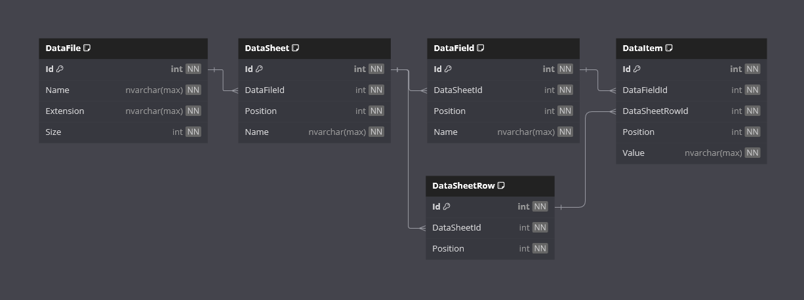

<h1>Excel Reader</h1>

Welcome to the Excel Reader App!

This is a .NET project designed to demonstrate reading, writing and manipulating data.

## Requirements

- [x] Application must be able to read data from an Excel spreadsheet into a database.
- [x] Application must delete the database (if it exists) and create a new one, including the schema objects.
- [x] The EPPlus package must be used to read the Excel files.
- [x] Application must not read into JSON first.
- [x] The database provider must be SQLite or SQLServer.
- [x] The application must get data from the database and display it in the console.
- [x] No user input is required.
- [x] The application must use appropriate logging.
- [x] A test Excel file is required.

### Additional Requirements

- [x] Application can read data from any Excel sheet (dynamic).
- [x] Application can also read data from CSV files.
- [x] Users can choose which files will be read.

## Features

- **Data File Reader**

    The application reads data Excel and CSV file and builds an object model.

- **Data Manager**

    The application can perform CRUD operation against a database.

- **Data Display**

    The application can displays data in a user friendly format in the console.

## Getting Started

### Prerequisites

- .NET 8 SDK installed on your system.
- A code editor like Visual Studio or Visual Studio Code.

### Installation

1. Clone the repository:
    - `git clone https://github.com/cjc-sweatbox/excel-reader.git`

2. Configure the application:
    - Navigate to the `.\src\ExcelReader.ConsoleApp\` directory.
    - Update the `appsettings.json` file with any personal preferences.

3. Build the application:
    - Navigate to the `.\src\` directory.
    - `dotnet build`

### Running the Application

1. Run the console application using the .NET CLI:
    - Navigate to the `.\src\ExcelReader.ConsoleApp\` directory.
    - `dotnet run`

### Usage

- **Configuration**:
Amend the `appsettings.json` file with your preferences.
    - Application Options:
        - DatabaseName: Used to build the sqlite connection string. Leave as default.
        - DatabaseExtension: Used to build the sqlite connection string. Leave as default.
        - WorkingDirectoryPath: Set to a directory that this application will use as its working directory. The required sub-directories will be created at run-time. Used to ingest files. Defaults to a `_test` directory at the repo level.
    - EPPlus, ExcelPackage, LicenseContext: Sets the `EPPlus` license. Allows values of `Commercial` or `NonCommercial`. Defaults to a `NonCommercial`.
    - Serilog: Configure any logging level requirements. Defaults to a `Debug`.

## How It Works

- **Logging**:
Uses the [Serilog](https://serilog.net/) library and it's `Sinks.Console` extension to write structured event data to the console.
- **Database Creation**:
On startup, any existing database will be deleted and a new one will be created.
- **Data File Processing**:
Iterates over the path set in `appsettings.json\ApplicationOptions\WorkingDirectoryPath` and any `.xlsx` or `.csv` files will be moved to the `Processing` directory; whereas, any other files will be moved to the `Error` directory. Once a file has been read successfully, it will be moved to the `Done` directory.
- **Data File Reading**:
Uses the [EPPlus](https://www.epplussoftware.com/) library to read any `.xlsx` or `.csv` files. Including any amount of columns/fields or worksheets (Excel).
- **Data Storage**:
Uses an SQLite database file to store data.
- **Data Access**:
Uses the [Dapper](https://www.learndapper.com/) ORM library to interact with the database.
- **Data Display**:
Uses the [Spectre Console](https://spectreconsole.net/) library and it's `Table` class to generate and display the processed data in structured and formatted tables.

## Database

## Contributing

Contributions are welcome!
Please fork the repository and create a pull request with your changes.
For major changes, please open an issue first to discuss what you would like to change.

## License

This project is licensed under the MIT License.
See the [LICENSE](./LICENSE) file for details.

## Contact

For any questions or feedback, please open an issue.

---
***Happy Excel Reading!***
